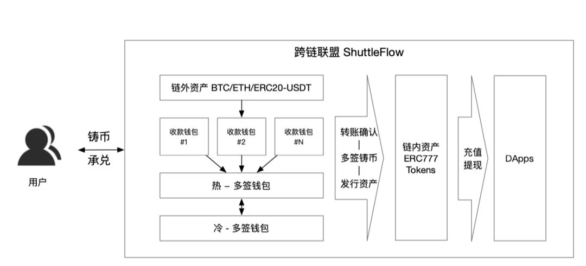

# Conflux Shuttleflow

Shuttleflow is Conflux cross chain solution to integrate user assets from bitcoin and
ethereum. It provides following cross chain functionalities:
* Support assets cross chain migration between conflux and bitcoin/ethereum/erc20 token.
* Enable anybody to add new cross chain erc20 token.
* Wrapping cross chain migration from ethereum defi to conflux defi(vice versa) to an atomic operation.

## Terminologies
* `Cross chain asset(reference token)`: The external chain asset that can be migrated to conflux chain by shuttleflow. Such as BTC, ETH, USDT.
* `cToken(Conflux Token)`: An ERC777 token on conflux backed 1:1 by tokens from other blockchain. e.g. 1 cBTC is backed by 1 bitcoin.
* `User`: The people who want to transfer assets from other blockchain to Conflux using shuttleflow.
* `Token Sponsor`: The sponsor of a specific cross chain asset. When user want to add a new erc20 to cross chain assets, 
he/she need to become the sponsor of that erc20 token, meanwhile some cETH should be mortgaged by the sponsor to conflux cross chain smart contract, which is used to reimburse the cross chain ethereum transaction 
fee of custodian alliance, the sponsor will be able to obtain and configure the mint/burn operation fee for user who want to migrate the corresponding erc20 token. 
* `Payment Wallet(Receive Wallet)`: For a conflux address `X`, there is a corresponding smart contract `P` on ethereum which is 
the payment wallet for `X`. If someone transferred `A` ETH to `C`, the custodian alliance will mint `A` cETH for 
`X`. On bitcoin, the payment wallet is a special multi-sig wallet.
* `Custodian Member`: A member of custodian alliance, holds 6 private keys: hot/cold wallet of conflux/ethereum/bitcoin chain.
* `Custodian Node`: Custodian service run independently by each custodian member, which hosts the hot wallet private key of 
custodian member, monitor the blockchain data and sign user's mint/burn requests, settle the mint/burn transactions on chain automatically
 when more than 2/3 signatures are collected.
* `Custodian Alliance`: A group of custodian members. Custodian alliance is able to mint/burn cToken for users when signatures from 
more than 2/3 custodian members are collected. It also maintain hot & cold wallet to manage users' cross chain assets.
* `Custodian Hot Wallet`: The multisig wallets of custodian alliance controlled by hot wallet private key of custodian members, which hold the users assets from other blockchain
(the assets transferred to payment wallets).
* `Custodian Cold Wallet`: The multisig wallets of custodian alliance controlled by cold wallet private key of custodian members. When amount of assets in alliance hot wallet is larger than upper bound, the part exceed the bound will be moved to cold wallet.
## Architecture

The workflow for a end user who want to use shuttleflow, they just need 3 steps:
1. Get the payment wallet address.
2. Transfer assets(BTC/ETH/ERC20) to payment wallet.
3. Check balance in conflux wallet(or assgined Defi) after custodian alliance processed user's request.

The detail operations between step 2 and 3 is demonstrated in the right part of the architecture:
1. Custodian alliance monitor the transactions/contract events on bitcoin/ethereum, discover the 
user payment and wait for it confirming.
2. For a confirmed user payment, the custodian alliance will retrieve the assets in user's 
payment wallet to custodian hot wallet, and mint corresponding cToken for user. This is 
made by custodian nodes run by custodian alliance automatically. 
3. User is able to use cToken to experience Defi product on conflux chain, such as Boomflow.

This rest document is organized as in the following sections:
* [Shuttleflow Contracts](smart_contract.md)
* [Custodian Node](custodian.md) (under development)
* [JSON RPC](json_rpc.md)
* [Conflux Cross Chain SDK](sdk.md)
